# AWS VPC Networking Lab  
**Private Subnet, Public Subnet, NAT Gateway, and S3 VPC Endpoint**

This project documents a full hands‑on AWS networking lab where I built a custom VPC from scratch, configured public and private subnets, launched EC2 instances, validated internal routing, and implemented secure internet access using a NAT Gateway and an S3 VPC Gateway Endpoint.

---

## 🏗️ AWS Architecture Diagram 

This lab uses a production-style AWS network design built with official AWS architecture standards:

- **VPC (10.0.0.0/16)**
  - Public Subnet (10.0.1.0/24)
    - EC2 Bastion Host (PublicWebServer)
    - NAT Gateway (with Elastic IP)
    - Public Route Table:
      - 0.0.0.0/0 → Internet Gateway
  - Private Subnet (10.0.2.0/24)
    - EC2 Private Instance (PrivateWebServer)
    - Private Route Table:
      - 0.0.0.0/0 → NAT Gateway
      - com.amazonaws.us-east-1.s3 → S3 Gateway Endpoint
- **Internet Gateway** attached to the VPC
- **S3 VPC Gateway Endpoint** for private S3 access

### Traffic Flows
- Private EC2 → NAT Gateway → Internet  
- Private EC2 → S3 Endpoint → S3 (no NAT required)  
- Laptop → IGW → Bastion → Private EC2 (SSH)

  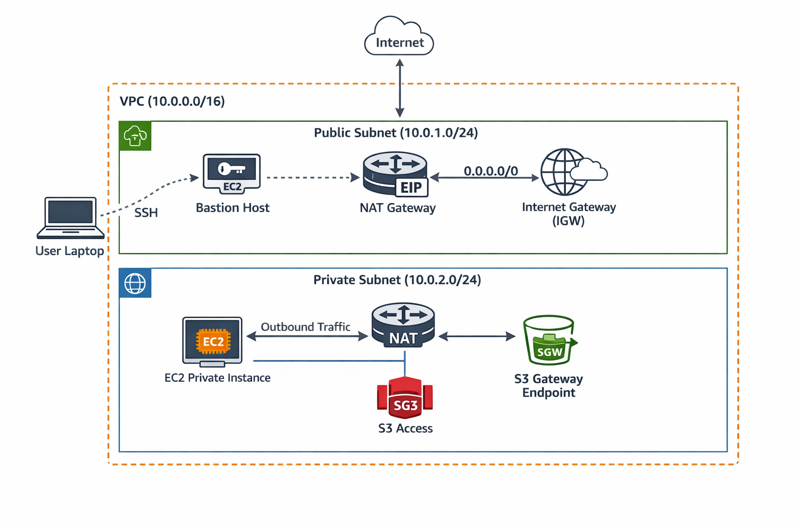

----

## 📌 Architecture Overview

This lab includes:

- 1 VPC  
- 1 Public Subnet  
- 1 Private Subnet  
- Internet Gateway  
- Public Route Table  
- Private Route Table  
- Public EC2 Instance (Bastion)  
- Private EC2 Instance  
- NAT Gateway  
- S3 VPC Gateway Endpoint  

---

# 🧩 Part 1 — VPC & Subnet Setup

### Step 1 — Create a VPC

### Step 2 — Create Two Subnets
- Public Subnet  
- Private Subnet  

### Step 3 — Create an Internet Gateway

### Step 4 — Attach the Internet Gateway to the VPC

### Step 5 — Create a Public Route Table
- Add route: `0.0.0.0/0 → Internet Gateway`

### Step 6 — Associate Public Subnet with Public Route Table  
This makes the subnet publicly accessible.

### Step 7 — Enable Auto‑Assign Public IPv4

### Step 8 — Launch Two EC2 Instances
- Public EC2 (bastion)
- Private EC2 (internal only)

### Step 9 — SSH into Public Instance  
Used the provided SSH command to connect.

---

# 🔐 Part 2 — Security Groups & Internal Connectivity

### Step 1 — Create a New Security Group for the Private Instance
- Only allow SSH **from the public instance’s security group**

### Step 2 — Validate Security  
Your private instance is now correctly protected and ONLY reachable from inside the VPC.

### Step 3 — Test Internal Connectivity  
From the public instance:

- Ping the private instance  
- SSH using its private IP  

This confirmed:
- Subnets can communicate  
- Routing is correct  
- Security groups are correct  
- *“My public subnet can now reach my private subnet within the VPC.”*

### SSH Issue Fix  
SSH initially failed because the private instance did not recognize the key pair.  
Solution: verify the correct key pair in instance details.

### Internet Test (Failed)  
The private instance could not reach the internet — expected at this stage.

---

# 🌐 Part 3 — NAT Instance Attempt (Failed by Design)

You attempted to use a regular EC2 instance as a NAT instance.  
This failed because a standard EC2 instance does **not**:

- Enable IP forwarding  
- Configure iptables for NAT  
- Forward packets for other subnets  

Even with route tables pointing to its ENI, traffic was dropped.

---

# 🚀 Fix — Deploy NAT Gateway (Correct Solution)

### Step 6 — Create NAT Gateway  
Placed in the public subnet.

### Step 7 — Disable Source/Destination Check  
(Not needed for NAT Gateway, only NAT instances — but included in your attempt.)

### Step 8 — Update Private Route Table  
Add route: 0.0.0.0/0 → NAT Gateway

After associating the private subnet with the correct route table:

- *“Private subnet now has internet access.”*

---

# 📦 S3 VPC Gateway Endpoint (Best Practice)

### Why Add an S3 Endpoint?
- Free (no NAT data processing charges)
- Faster (direct AWS backbone)
- More secure (traffic never touches the internet)
- More reliable (not dependent on NAT Gateway)
- Simplifies architecture

### Configuration
- Service: `com.amazonaws.us-east-1.s3`
- Type: **Gateway**
- Attach to private route table
- Policy: Full access

### Result  
Private instance can now reach S3 without using NAT Gateway.

---

# 🧠 Key Learnings

### ✔ Public vs Private Subnets  
### ✔ Route Tables & IGW  
### ✔ Security Group Scoping  
### ✔ NAT Gateway vs NAT Instance  
### ✔ S3 VPC Endpoint Benefits  
### ✔ Internal-only EC2 access patterns  
### ✔ Troubleshooting SSH & routing failures  

---

# 📸 Screenshots

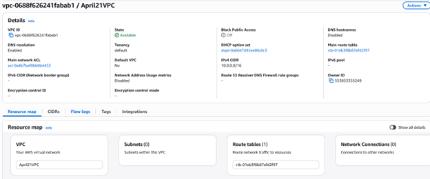
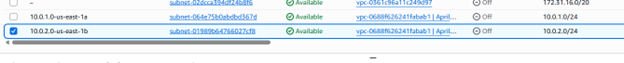
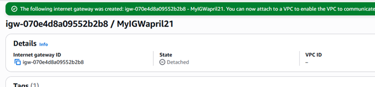
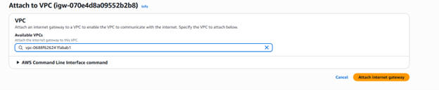
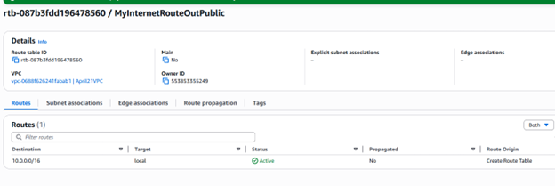
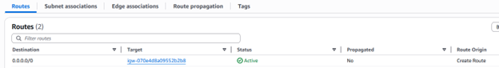
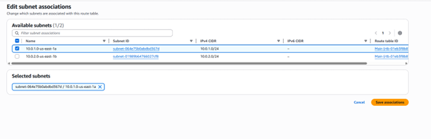
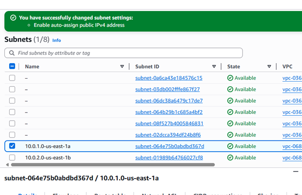
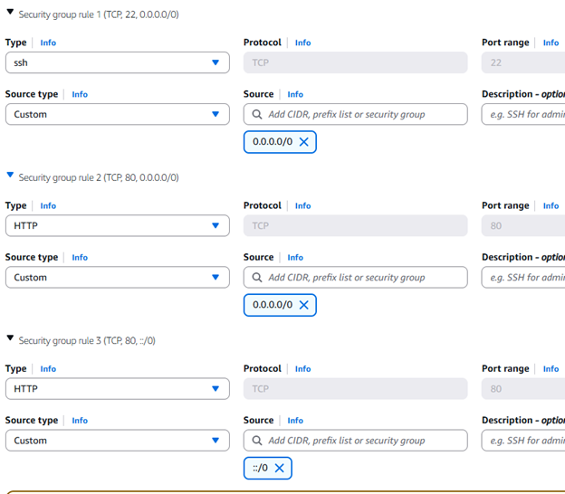
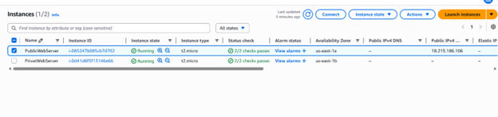
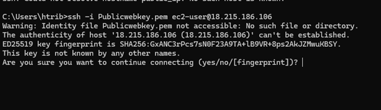
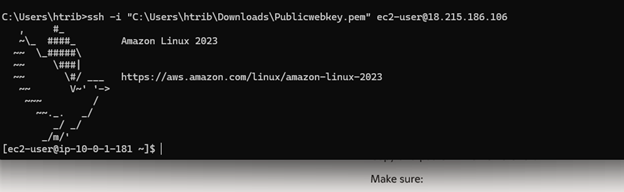
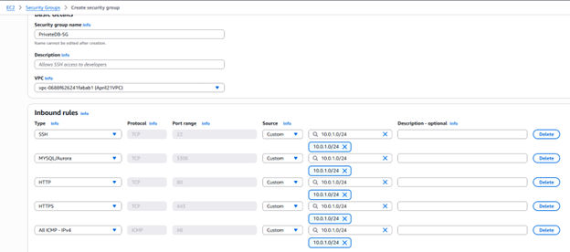
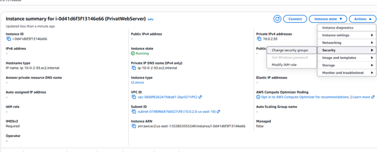
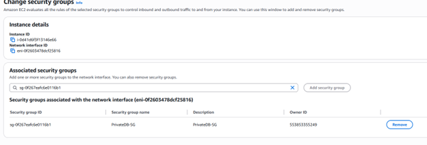
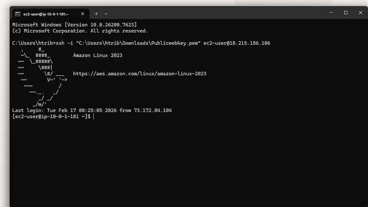
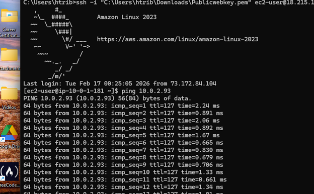
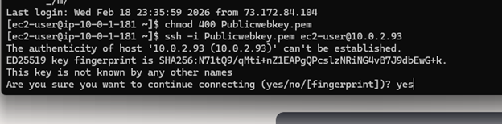
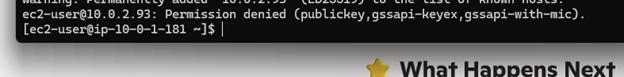
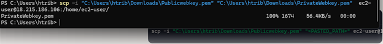
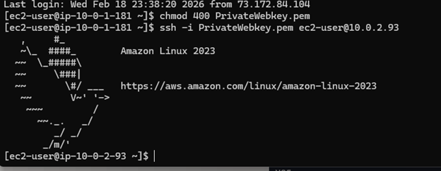
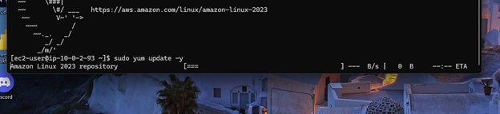
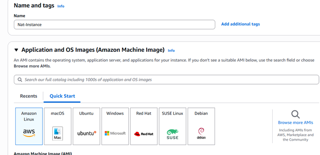
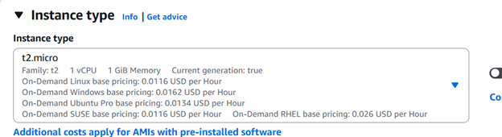
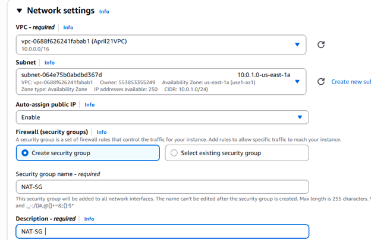
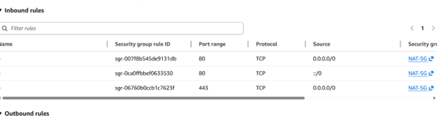
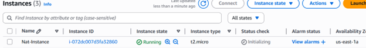
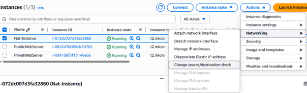
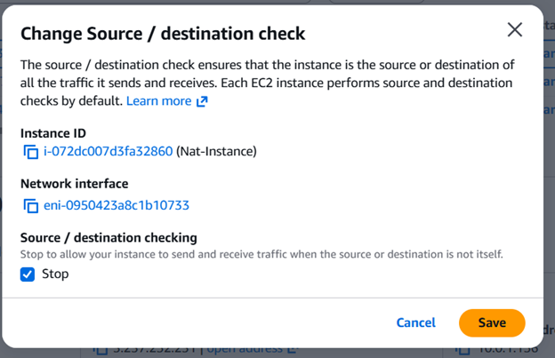
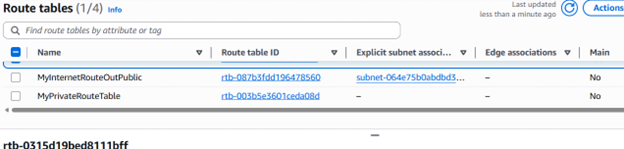
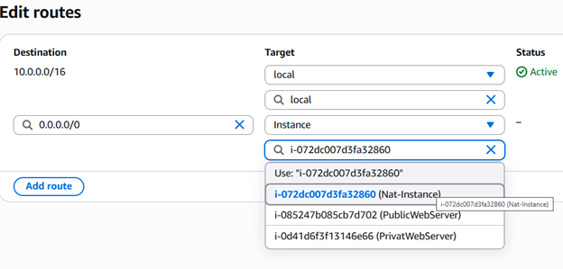
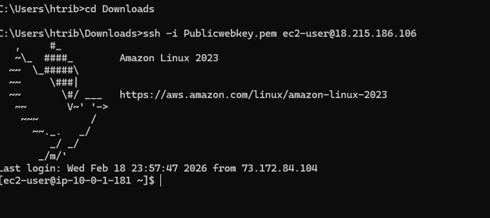
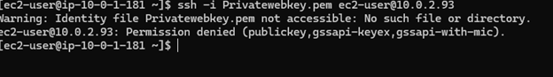
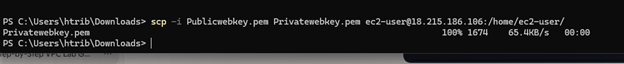
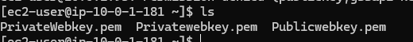
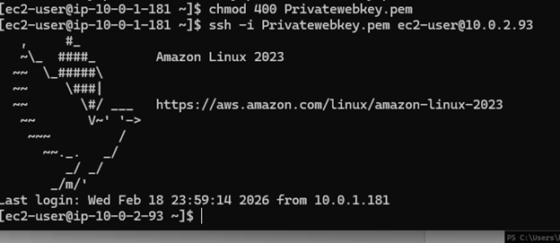
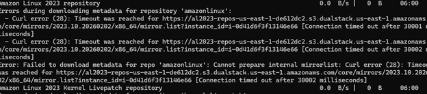
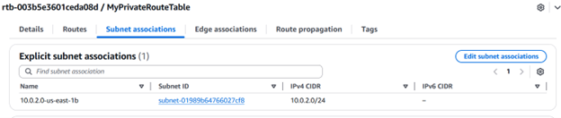
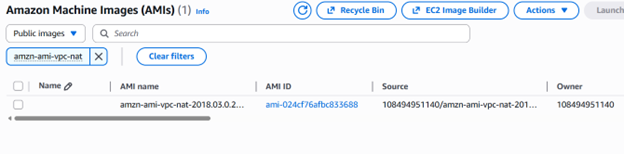
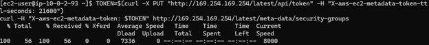
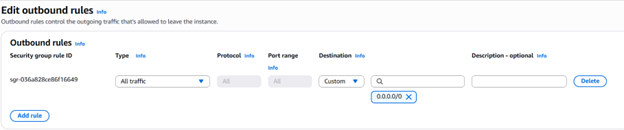
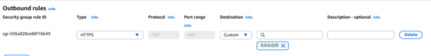
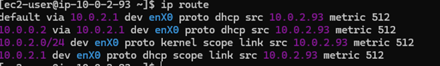

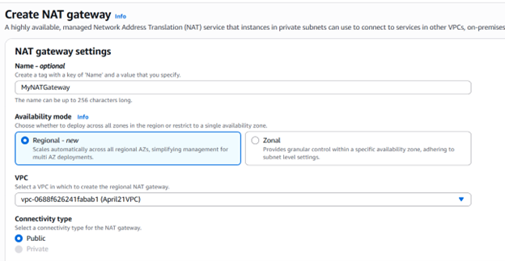
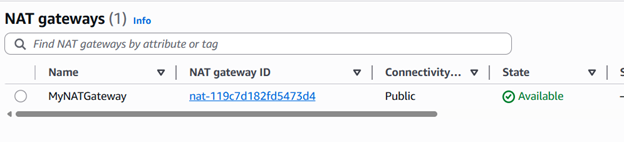
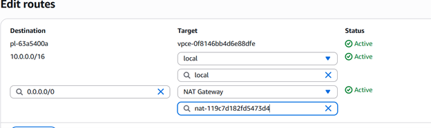
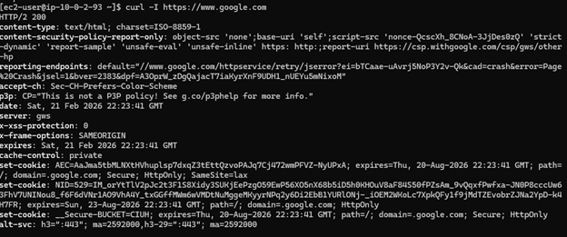
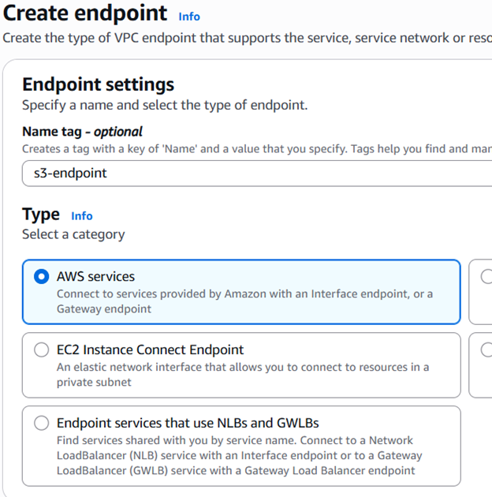
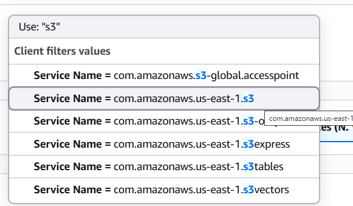

